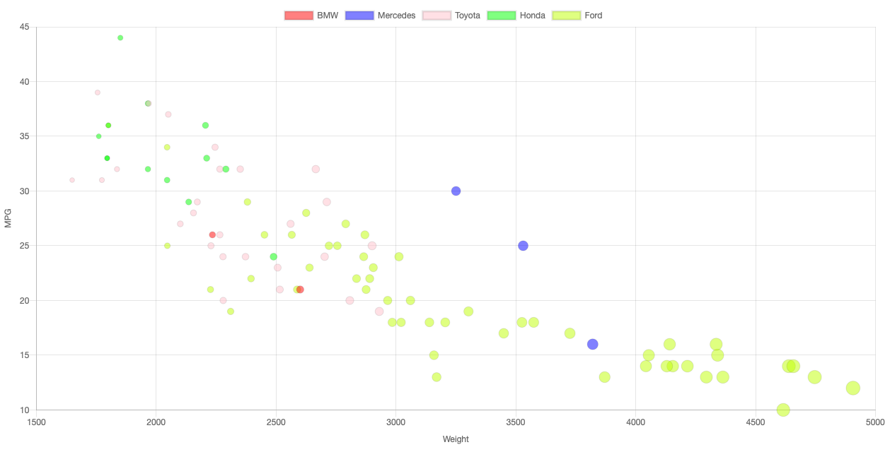
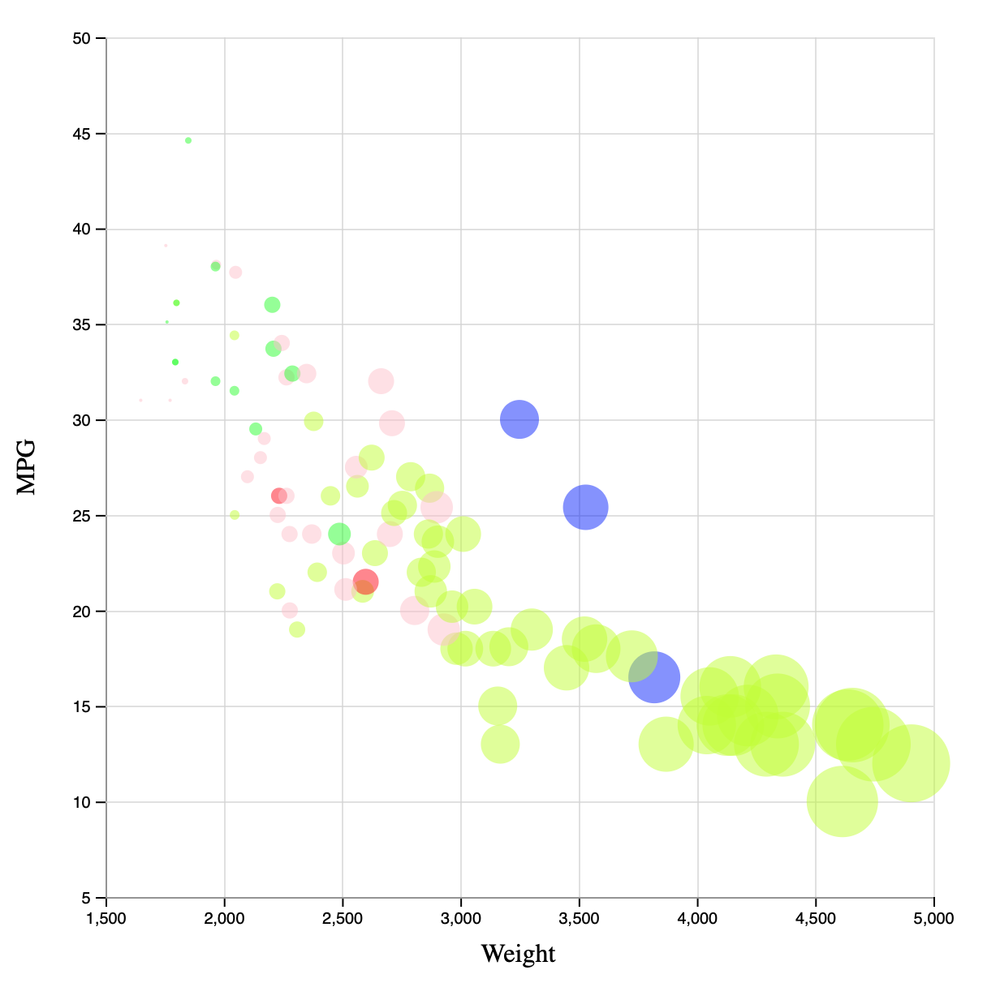
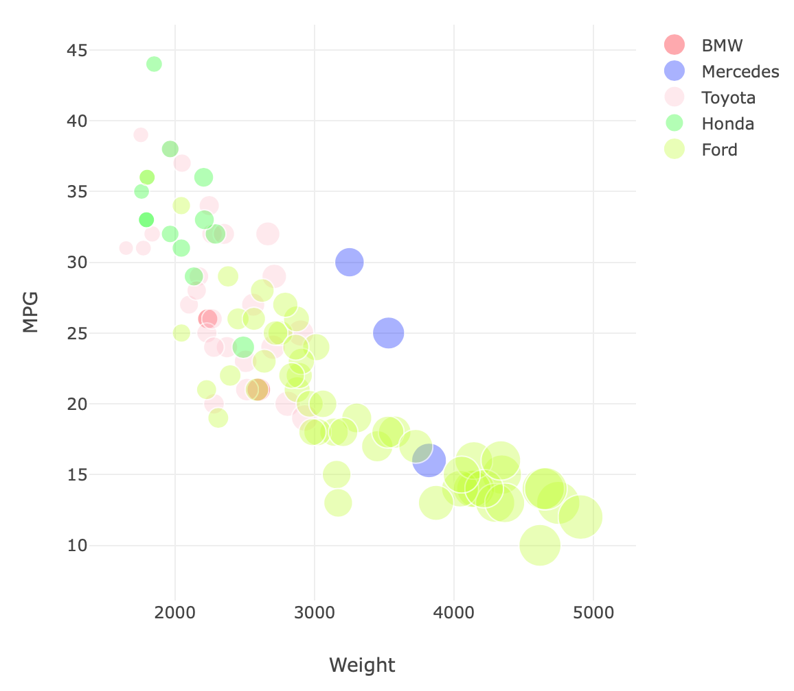
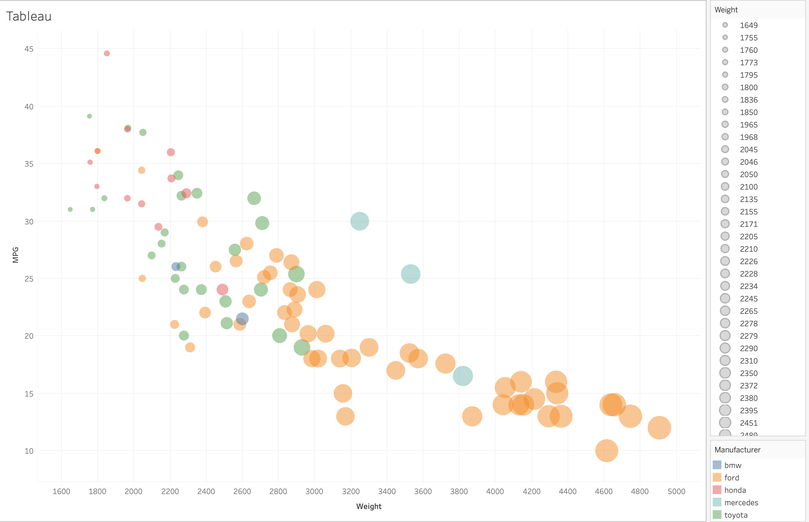

Assignment 2 - Data Visualization, 7 Ways  
===

# chartist.js

Chartist is a JavaScript library that lets you make responsive charts. While they don’t support scatter charts by default, there was a way to hack a line chart into a scatter plot. In order get color by manufacturer, I had to separate data for each manufacturer into its own series. They don’t support things like axis labels by default, but there are plugins that let you customize the charts some more. Overall, chartist was decent, but its documentation wasn’t the greatest. I could not figure out how to get a legend in chartist.

# chart.js

Chartjs is a JavaScript library for charting. It was one of my favorite libraries to use, since it was simple and extensible. Adding axis's and customizing colors and point sizes was pretty simple, and the chart comes default with a cool animation. It also gives a nice key, which lets you toggle different series on and off. Overall a very nice library.

# d3.js

D3js was a lot simpler than I thought it would be. Having messed with d3 in the past, I was initially a bit intimidated by the library, but I quickly found out that making this simple scatter plot was easy in d3. Documentation took a bit of getting used to, and the library does what you tell it to and no more. Setting axis labels was a big tricky but I managed to figure it out with some googling.

# matplotlib

Matplotlib is a python package that makes charting super simple. In just a few lines of code, I was able to get a simple scatter chart with colors and point sizes. I did notice that the sizing of points wasn’t as noticeable as I wanted it, and I played with some code to make it better but couldn’t make it exactly how I wanted it. Overall, matplotlib is a nice and simple library that makes charting easy.

# nvd3

Nvd3 is a JavaScript library built on top of d3, with a focus on reusable charts. I am very conflicted on this library - on one side, it is one of the most customizable libraries that I have used. It makes some very nice charts. However, the library really isn’t updated anymore. The last commit to master was over a year ago. Additionally, I had to use d3 v3 in order to get my chart working - 2 versions of d3 in the past. While I really like this library, I would not recommend it for any production charts since it is not being maintained.

# plotly.js

Plotly is an awesome JavaScript library that makes creating charts simple. It is built on top of d3 and is very high level in comparison. It has some really good documentation, and some of the best out of the box features on chart customizations. I would definitely use this library for charting in the future.

# tableau

Tableau is a business intelligence platform that is used by many data analysts. It reminded me of an excel that was dedicated to plotting and analyzing data. I found the documentation was not very good, and oftentimes was out of data or did not work on my mac. However, I did figure out how to create a chart, as well as manipulate the colors and sizes of the points. This software is easy to use, and I would recommend it over excel as a no code charting software.

## Technical Achievements
- **Something**: Text

## Design Achievements
- **Something**: Text
